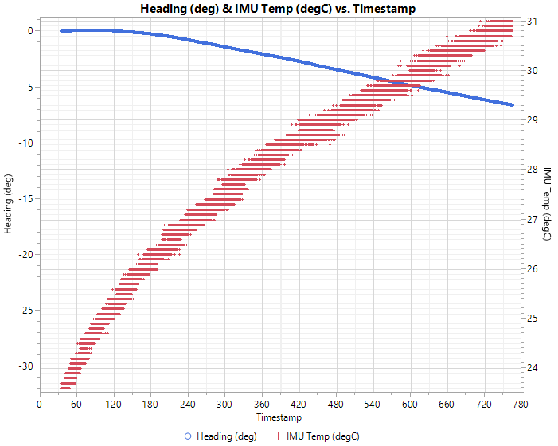

## ADIS16470.java

This a copy of the WPILib provided driver with a few minor changes to improve the no-motion drift. Before using this version, the drift while under motion (spin for X seconds, move to know heading, and record IMU heading) needs to be verified it is working better than the WPILib driver setup.

* The update rate was increased to 200Hz to provide new sensor informationo at the same rate as the controller.
* The device is reset to the factory defaults.
* The device selftest is run and reported (along with other configuration registers).
* The thread will sleep for 30 seconds to allow the CBE to accumulate data. Note: This can and should be decreased.
* The default SPI data was changed (replaced Z-axis acceleration with the die temperature)

### Baseline Driver No-Motion Drift

### Factory Default Driver No-Motion Drift
